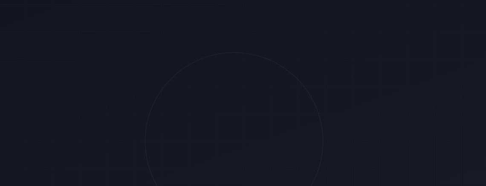
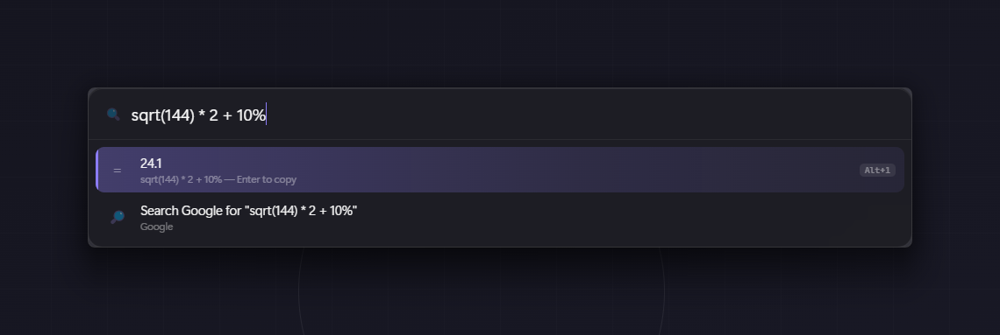
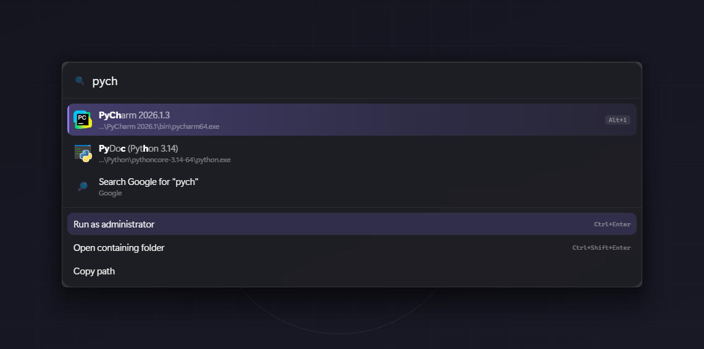
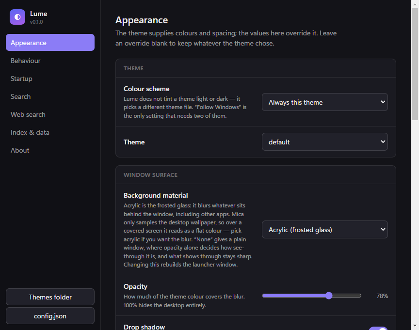
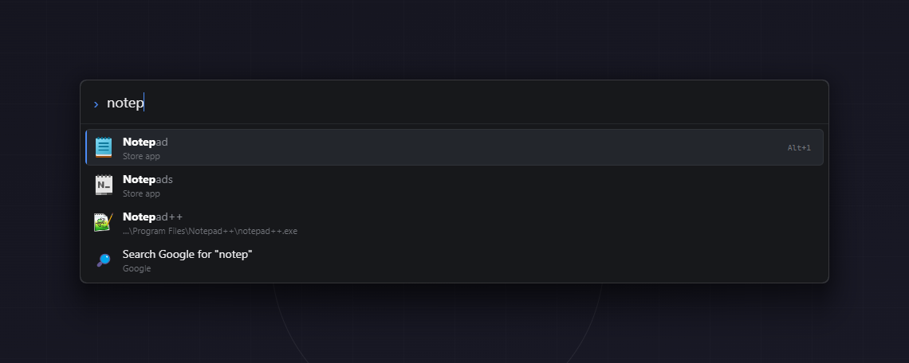
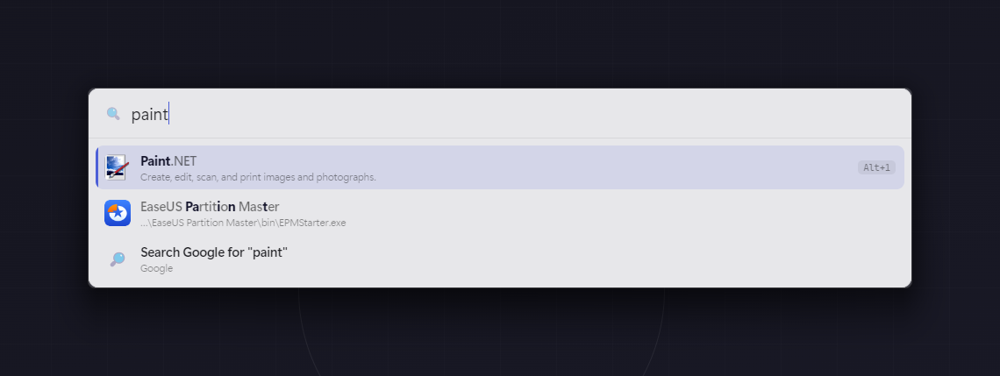

# Lume

A keyboard launcher for Windows, built to be themed in plain CSS.

Press `Alt+Space`, type a few letters, hit Enter. It learns which app you meant.



## Why this exists

Flow Launcher is good, but its themes are WPF `ResourceDictionary` XAML: to move a
padding value you fight `ControlTemplate` overrides, and to see the result you restart
the app. Lume renders its UI in a Chromium window, so a theme is one `.css` file with
custom properties — save it and the running launcher restyles itself instantly.

## Installing

Download from [the latest release](https://github.com/limburatorul/lume/releases/latest).

- `Lume-<version>-x64.exe` — per-user install, so no admin prompt. Adds
  Start-menu and desktop shortcuts, and can start with Windows.
- `Lume-<version>-portable.exe` — self-extracting, nothing installed. Settings
  still live in `%APPDATA%\Lume`.

Each release lists SHA256 checksums for both files.

`Lume.exe --settings` opens the settings window directly.

Windows 11 x64. The frosted-glass backdrop needs 22H2 or newer; on anything
older set **Background material** to `None` and use the opacity slider.

### Windows will warn you the first time

The builds are **not code-signed**, so Microsoft Defender SmartScreen shows
"Windows protected your PC" and hides the run button behind **More info →
Run anyway**. Some browsers also flag the download.

This is not a detection of anything in the app — SmartScreen reacts to any
executable that lacks a signature and download history. If that is not good
enough for you, and it is a reasonable thing to insist on, build it yourself:
`npm install && npm run package` produces exactly the same executables from the
source in this repository.

See [Code signing](#code-signing) for what it would take to remove the warning.

## Running from source

```bash
npm install
npm start
```

For development, `npm run dev` starts esbuild in watch mode; run `electron .` in a
second terminal. `npm test` runs the ranking and calculator checks.

To inspect a running instance, start it with `--remote-debugging-port=9333` and
evaluate an expression inside either window:

```bash
node scripts/inspect.mjs 9333 renderer "getComputedStyle(document.querySelector('.lume')).backgroundColor"
```

That is how the theme and settings plumbing is checked without guessing from
screenshots — `renderer` targets the launcher, `settings` the settings window.

`node scripts/shots.mjs` regenerates the images in this README. The frosted
glass only exists in the composited desktop, so those have to be real screen
grabs; the script paints a full-screen backdrop first and crops to the window,
which keeps whatever is actually on your desktop out of the pictures.

To build the installer and portable executable into `release/`:

```bash
npm run package
```

## What it does

**Applications** — indexes Start Menu shortcuts, Desktop shortcuts, and Store/UWP
apps (icons and all). Fuzzy matching handles prefixes (`pych` → PyCharm), acronyms
(`vsc` → Visual Studio Code) and typo-free subsequences. Ranking blends the match
quality with what you actually launch, so the second time you type `ard` the right
Arduino is already first.

**Calculator** — type an expression: `sqrt(144) * 2`, `2^10`, `17 % 5`, `12k / 4`,
`0xff`. Enter copies the result. Parsing is a hand-written tokenizer and shunting-yard
evaluator, not `eval`.



**Web search** — `g rust traits`, `yt lofi`, `gh electron`, and so on. Engines are
defined in `config.json`. Typing a bare domain (`github.com/foo`) offers to open it.

**Shell** — anything after `>` runs in PowerShell or cmd. Enter keeps the console
open; the alternate actions run it hidden or elevated.

**System commands** — `lock`, `sleep`, `shut down`, `empty recycle bin`, plus the
launcher's own `Lume: …` commands (rebuild index, open themes folder, devtools).

## Keys

| Key | Action |
| --- | --- |
| `Alt+Space` | Show / hide (configurable) |
| `↑` `↓`, `Ctrl+P` / `Ctrl+N` | Move selection |
| `Enter` | Run the selected result |
| `Ctrl+Enter` | Run as administrator |
| `Ctrl+Shift+Enter` | Open containing folder |
| `Tab` | Show all actions for the selection |
| `Alt+1` … `Alt+9` | Run result N directly |
| `Esc` | Clear the query, then hide |

`Tab` opens every action the selected result supports:



## Settings

Open the settings window from the tray icon, by typing `settings` in the
launcher, or with `Lume.exe --settings`. Changes apply immediately — there is no
Save button, and everything is written straight to `config.json`.



- **Appearance** — theme per colour scheme, background material, opacity, window
  width, row and icon size, fonts, corner radius, vertical position, animation.
- **Behaviour** — hotkey, with a live badge saying whether Windows actually
  granted it; which monitor to open on; hide-on-blur; what happens to the last
  query; search delay; how strongly launch history outranks match quality.
- **Startup** — start with Windows, start hidden, tray icon.
- **Search** — extra folders to index, title exclusions, shell prefix and shell.
- **Web search** — add, edit and remove engines; pick the fallback.
- **Index & data** — index counts by kind, rebuild, forget launch history, clear
  the icon cache, reset every setting.

### Opacity and blur are two different controls

- **Background material** decides whether Windows blurs what is behind the
  window. `acrylic` is the frosted-glass one. `none` means no blur at all, so a
  partly transparent window shows a *sharp* desktop through it.
- **Opacity** decides how much of the theme colour covers that background. At
  100% the window is solid and the material stops mattering.

Frosted glass is `acrylic` plus an opacity somewhere around 70–90%.

| Material | Effect |
| --- | --- |
| `acrylic` | Blurs whatever is behind the window, apps included — the frosted look |
| `mica` | Samples only the desktop wallpaper, so it reads flat over other windows |
| `tabbed` | Mica variant, same caveat |
| `none` | No system material; opacity alone decides transparency, and it stays sharp |

Switching between `none` and a material rebuilds the launcher window, because
whether the window is transparent can only be decided when it is created.

One implementation note, because it is easy to break: the launcher window keeps
`thickFrame: true`. DWM will not draw a backdrop material *or* rounded corners on
a frameless window that has had `WS_THICKFRAME` removed — it renders an opaque
rectangle with square corners instead, whatever `backgroundMaterial` is set to.
The window is kept non-resizable through `resizable: false`.

## Theming

Themes live in `themes/*.css` when running from source, and in
`%APPDATA%\Lume\themes\` once installed. Select one in the settings window, or
with `"theme"` in `config.json`.

Settings that override a theme are applied as a second stylesheet after it, so
clearing an override in the settings panel hands the value back to the theme.

The four built-in themes are owned by the app and are refreshed on startup when
a new version ships a newer copy — otherwise a theme written against an older
`base.css` keeps referring to properties the UI no longer reads, and the
settings that drive them quietly stop working. Your own edits are safe:
`themes/.builtin.json` records the hash of each file Lume wrote, and any file
whose contents no longer match is left alone (the startup log names it). Themes
you create yourself are never touched at all.

Every value the UI uses is a custom property declared in `src/renderer/base.css`.
A theme overrides the ones it cares about:

```css
:root {
  /* Colour and alpha are separate so the opacity slider can drive the alpha. */
  --surface-rgb: 20 20 26;
  --surface-opacity: 0.82;
  --radius: 16px;
  --row-height: 52px;
  --accent: #8b7cf6;
  --match-color: #ffffff;
  --title-color-dim: rgba(255, 255, 255, 0.62);
}
```

Themes are ordinary stylesheets, so anything CSS can do is available — gradients on
the selected row, `backdrop-filter` on individual rows, `::after` highlights. See
`themes/default.css` for a commented starting point, or copy any of `carbon.css`,
`glass.css`, `light.css`.

The same launcher in `carbon` and `light` — no code changed, only the stylesheet:





Saving a theme file re-applies it in the running app. `Lume: Toggle developer tools`
opens Chromium devtools against the launcher window, so you can inspect and tweak
live before writing the change into the file.

## Configuration file

Everything in the settings window is stored in `%APPDATA%\Lume\config.json`,
which is watched — edit it by hand and the running app picks the change up.

| Key | Meaning |
| --- | --- |
| `hotkey` | Electron accelerator, e.g. `Alt+Space`, `Ctrl+Shift+Space` |
| `hideOnBlur` | Hide when focus is lost |
| `showAtTopmost` | Stay above other windows, including full-screen apps |
| `lastQueryMode` | `empty` \| `preserve` \| `select` |
| `searchDelay` | Milliseconds to wait after a keystroke; 0 searches on every key |
| `colorScheme` | `fixed` uses `theme` always; `system` swaps with Windows |
| `theme` / `themeLight` | Theme file names without `.css`; `themeLight` only matters under `system` |
| `backdrop` | `acrylic` \| `mica` \| `tabbed` \| `none` |
| `useDropShadow` | Shadow behind the window |
| `useAnimation` / `animationSpeed` | Open animation and its length in ms |
| `windowWidth` | Window width in px |
| `maxResults` | Rows shown at once |
| `verticalAnchor` | 0 = top of screen, 1 = bottom |
| `searchWindowScreen` | `cursor` \| `focus` \| `primary` |
| `showPlaceholder` / `placeholder` | Placeholder text in the query box |
| `ui.*` | Theme overrides; `null` means "use the theme's value" |
| `launchOnStartup` | Register a Windows login item |
| `hideOnStartup` | Start to the tray instead of showing the window |
| `showTrayIcon` | Show the tray icon |
| `extraAppFolders` | Extra folders to index for `.lnk` / `.url` / `.exe` |
| `excludePatterns` | Title substrings to drop from the index |
| `searchEngines` | `{ keyword, name, url, glyph }`, `{q}` is the query |
| `defaultEngine` | Keyword used for the fallback web result |
| `shellPrefix` / `shell` | Command prefix and `powershell` \| `cmd` |
| `frecencyWeight` | 0 disables usage learning, 1 ignores match quality |

The file is UTF-8 without a BOM. Lume tolerates a BOM if your editor adds one,
but PowerShell 5.1's `Get-Content`/`Out-File` will mangle non-ASCII values on a
round trip unless you pass `-Encoding UTF8` — prefer the settings window.

## Code signing

Signing is what removes the SmartScreen warning, and it is worth being precise
about what it buys, because the situation changed recently.

**Signing alone does not silence SmartScreen.** Reputation accrues to the
certificate and to each file hash, and it is earned through clean downloads over
time. Extended Validation (EV) certificates used to grant reputation
immediately; Microsoft removed that behaviour in 2024, and its own documentation
now states plainly that EV no longer bypasses the warning. So paying the EV
premium purely to skip SmartScreen no longer makes sense — an OV certificate
builds reputation on the same terms.

What signing does give you straight away: your name shown as the publisher
instead of "Unknown publisher", no warning at all once reputation is
established, and one identity carried across releases so each new version starts
from the trust the previous ones earned.

Since June 2023 the private key may no longer live in a `.pfx` on disk — it has
to sit on a hardware token or in a cloud HSM. That rules out the old "commit an
encrypted certificate to CI" approach and shapes the options:

| Option | Rough cost | Notes |
| --- | --- | --- |
| [Azure Trusted Signing](https://azure.microsoft.com/en-us/pricing/details/trusted-signing/) | $9.99/month | Cheapest credible route, and open to individual developers. Identity check is photo ID plus a liveness selfie. Microsoft manages the key, so there is no token to carry. |
| [Certum Open Source](https://shop.certum.eu/code-signing.html) | ~€69 first year, ~€29 renewal | Aimed at open-source authors. Ships as a smartcard and reader, or through their SimplySign cloud service if you would rather not have hardware. |
| DigiCert / Sectigo / SSL.com / GlobalSign OV | ~$200–400/year | The traditional CAs. No advantage over the above for SmartScreen purposes. |
| Self-signed | free | Useless here. It only helps on machines that already trust your certificate, so it does nothing for anyone downloading a release. |
| [winget](https://github.com/microsoft/winget-pkgs) or the Microsoft Store | free | Sidesteps the question: Store packages are signed by Microsoft, and installing through winget avoids the browser download path entirely. |

Note that from 27 February 2026 a code signing certificate is valid for at most
459 days, so renewals come round sooner than they used to.

Once you have a certificate, electron-builder does the rest. For Trusted Signing
it is an `azureSignOptions` block in the `win` section of `package.json`; for a
token or cloud CSP it is `signtoolOptions` pointing at the certificate. Whichever
you pick, sign **and timestamp** every release with the same certificate —
switching certificates resets the reputation you have accumulated.

## Layout

```
src/main/          Electron main process
  indexer/         Start Menu + UWP enumeration (uwp.ps1 does the Store side)
  providers/       apps, calculator, websearch, shell, system
  search/          fuzzy matcher and the provider aggregator
  icons.ts         lazy icon extraction with an on-disk cache
  store.ts         usage learning (frecency + query→result affinity)
  settingsWindow.ts  the settings window
src/preload/       the narrow APIs exposed to each window
src/renderer/      the launcher UI: index.html, base.css, main.ts
src/settings/      the settings UI, built from a field schema
themes/            theme stylesheets
```

State lives in `%APPDATA%\Lume\`: `config.json`, `usage.json`, `appindex.json`,
`iconcache/`.
